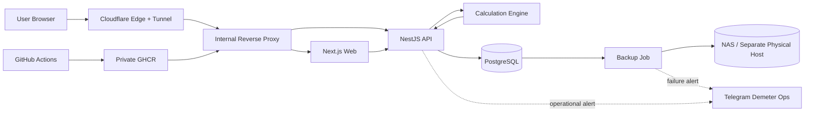
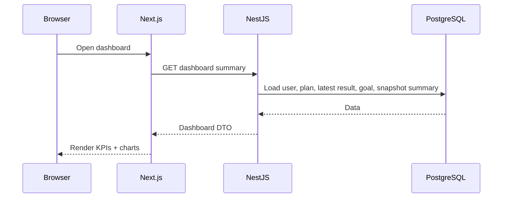
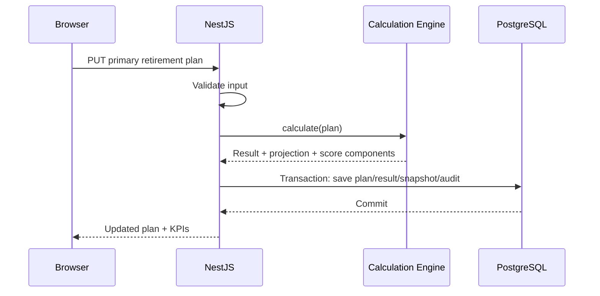
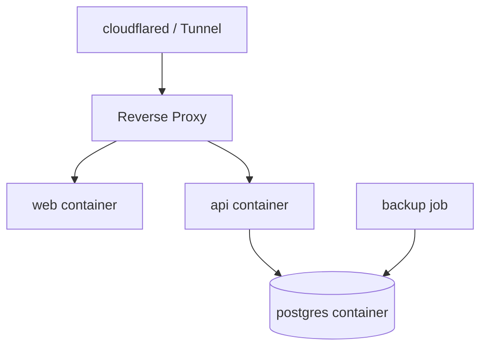
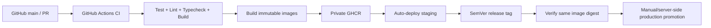
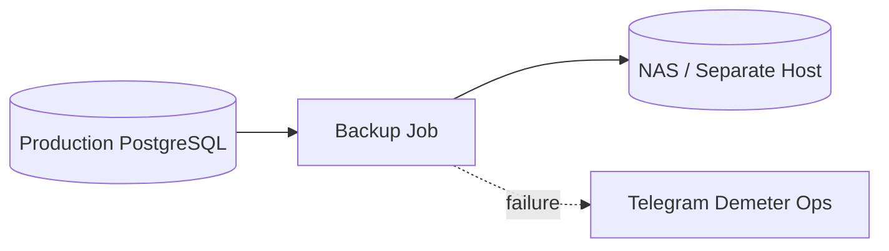

# Demeter Retirement Planner — System Architecture

## 1. Architecture Goals
The architecture should:
- support a production-grade private/internal beta,
- keep application logic modular and testable,
- isolate financial calculation logic from framework code,
- support future Monte Carlo simulation,
- support future B2B/white-label evolution without overbuilding tenancy in v1,
- keep production deployment simple enough for a single VM and Docker Compose,
- preserve a path toward managed infrastructure later.

---

# 2. High-Level Architecture



Note: image delivery in production is performed by Docker on the production host; the diagram shows GHCR as the image source for the deployment environment.

---

# 3. Repository Architecture

Recommended monorepo layout:

```text
Demeter/
├── apps/
│   ├── web/                    # Next.js
│   └── api/                    # NestJS
├── packages/
│   ├── calculation-engine/     # deterministic engine, Monte Carlo-ready
│   ├── contracts/              # shared DTO/schema/types where appropriate
│   ├── config/                 # shared lint/ts config
│   └── ui/                     # optional shared UI primitives
├── prisma/
│   ├── schema.prisma
│   └── migrations/
├── docs/
├── ops/
│   ├── deploy.sh
│   ├── rollback.sh
│   ├── backup.sh
│   ├── health-check.sh
│   └── smoke-test.sh
├── infra/
│   ├── compose/
│   └── reverse-proxy/
├── .github/
│   └── workflows/
└── docker-compose.yml
```

The exact workspace tooling can be npm/pnpm-based, but the architecture should maintain hard boundaries between web, API, and calculation engine.

---

# 4. Frontend Architecture

## Stack
- Next.js
- TypeScript
- TailwindCSS
- shadcn/ui
- Recharts

## Responsibilities
Frontend should handle:
- authentication screens,
- retirement-plan forms,
- dashboard rendering,
- charts,
- scenario editor/comparison,
- goal tracking,
- admin UI,
- client-side input validation for UX,
- theme and responsive behavior.

The frontend must not be the authoritative implementation of financial formulas.

## Recommended feature structure

```text
apps/web/src/
├── app/
│   ├── (public)/
│   ├── (auth)/
│   ├── dashboard/
│   ├── plan/
│   ├── scenarios/
│   ├── goals/
│   └── admin/
├── features/
│   ├── auth/
│   ├── retirement-plan/
│   ├── dashboard/
│   ├── scenarios/
│   ├── goals/
│   └── admin/
├── components/
├── lib/
│   ├── api/
│   ├── format/
│   └── validation/
└── hooks/
```

## State model
Prefer:
- server state from API,
- local form state for temporary edits,
- URL state only where useful for navigation,
- scenario drafts isolated from the primary saved plan.

Avoid duplicating the authoritative retirement calculation in React state.

---

# 5. Backend Architecture

## Stack
- NestJS
- Prisma ORM
- PostgreSQL

## Suggested modules

```text
apps/api/src/
├── auth/
├── users/
├── retirement-plans/
├── calculations/
├── scenarios/
├── goals/
├── snapshots/
├── admin/
├── audit/
├── health/
└── common/
```

### AuthModule
Responsibilities:
- registration,
- login,
- logout,
- password hashing,
- sessions/refresh tokens,
- guards,
- role enforcement.

### UsersModule
Responsibilities:
- user profile,
- account status,
- role,
- administrative user lifecycle.

### RetirementPlansModule
Responsibilities:
- primary plan CRUD,
- validation,
- orchestration of recalculation,
- calculation-version traceability.

### CalculationsModule
Responsibilities:
- adapt API plan data into the calculation engine,
- persist calculation results,
- expose calculation summaries/projection series.

It must not contain duplicated copies of the mathematical formulas if those live in `packages/calculation-engine`.

### ScenariosModule
Responsibilities:
- build scenario overrides from primary plan,
- run non-mutating comparison calculations,
- optionally persist named scenarios later.

### GoalsModule
Responsibilities:
- primary goal,
- milestones,
- progress status.

### SnapshotsModule
Responsibilities:
- historical saved-state snapshots,
- immutable trend records.

### AdminModule
Responsibilities:
- protected administrative endpoints,
- user lifecycle actions.

### AuditModule
Responsibilities:
- structured immutable audit records,
- request/actor context.

### HealthModule
Responsibilities:
- `/health`
- `/ready`
- database readiness.

---

# 6. Calculation Engine Architecture

The calculation engine is a domain package independent of NestJS and Next.js.

Recommended interface concept:

```ts
interface RetirementCalculationEngine {
  calculate(input: RetirementCalculationInput): RetirementCalculationResult;
}
```

Future simulation architecture:

```ts
interface ProjectionEngine<TInput, TResult> {
  calculate(input: TInput): TResult;
}

class DeterministicProjectionEngine
  implements ProjectionEngine<RetirementInput, DeterministicResult> {}

class MonteCarloProjectionEngine
  implements ProjectionEngine<SimulationInput, MonteCarloResult> {}
```

## Required engine qualities
- deterministic for identical input + version,
- pure or near-pure functions,
- no direct DB dependency,
- no HTTP dependency,
- explicit calculation version,
- isolated score calculation,
- unit-testable edge cases.

Recommended package layers:

```text
packages/calculation-engine/src/
├── domain/
│   ├── inputs.ts
│   ├── outputs.ts
│   └── assumptions.ts
├── deterministic/
│   ├── accumulation.ts
│   ├── drawdown.ts
│   ├── required-fund.ts
│   ├── required-contribution.ts
│   └── projection.ts
├── scoring/
│   ├── retirement-readiness.ts
│   └── financial-health.ts
├── validation/
└── version.ts
```

---

# 7. Request Flow

Typical dashboard request:



Plan update:



---

# 8. Persistence Strategy

Use PostgreSQL as the system of record.

Principles:
- monetary values stored using Decimal/Numeric,
- rates stored with explicit precision,
- historical snapshots are immutable,
- result records carry calculation version,
- auth/session tables are separate from retirement-domain tables,
- audit records do not duplicate secrets,
- soft-disable users via status rather than deleting accounts for routine admin operations.

---

# 9. Transaction Boundaries

A saved primary plan update should ideally use one database transaction for:
1. update plan,
2. create calculation result,
3. create historical snapshot,
4. update goal-derived state if necessary,
5. write important audit event.

The calculation itself can happen before opening the DB transaction if it is pure and based on validated input.

---

# 10. API Design Principles

- REST JSON API.
- DTO validation at API boundary.
- authenticated endpoints scoped to current user.
- admin endpoints protected by role guard.
- stable resource-oriented routes.
- backwards-compatible rollout by default.
- OpenAPI generated from NestJS annotations/schema definitions.
- request IDs propagated through logs and audit events.

Likely route groups:

```text
/auth
/users/me
/retirement-plan
/calculations
/scenarios
/goals
/snapshots
/admin/users
/health
/ready
```

Exact OpenAPI contract will be defined in the next architecture phase.

---

# 11. Security Architecture

## Public ingress
Only:

```text
Internet -> Cloudflare -> Cloudflare Tunnel -> Internal Reverse Proxy
```

No direct public inbound 80/443.

## Application security
- strong password hashing,
- secure HttpOnly session/refresh cookie where compatible with chosen auth design,
- CSRF strategy appropriate to session mechanism,
- server-side role guards,
- input validation,
- safe error responses,
- sensitive log redaction,
- Cloudflare edge rate limiting in v1.

## Database security
- PostgreSQL not exposed to Internet,
- ideally only Docker-private/internal host network,
- production DB credentials only on production host.

---

# 12. Deployment Architecture

Production VM:



Separate staging VM/environment:
- same logical topology,
- different secrets,
- different PostgreSQL volume,
- different domains,
- different tunnel,
- no raw production data.

---

# 13. CI/CD Architecture



GitHub may possess staging-only deployment credentials.

GitHub must not possess:
- production SSH credential,
- production DB password,
- production JWT/session secret,
- production Cloudflare tunnel secret.

---

# 14. Observability Architecture

Phase-1 baseline:
- structured application logs,
- request IDs,
- Docker log rotation,
- external uptime checks,
- host CPU/RAM/disk monitoring,
- PostgreSQL health,
- readiness/liveness endpoints,
- Telegram operational alerts.

Do not introduce a large centralized metrics/logging stack unless operational evidence justifies it.

---

# 15. Backup Architecture



Policies:
- nightly backup,
- pre-deploy backup,
- 30-day daily retention,
- pre-deploy backup failure blocks release,
- backup currently unencrypted in phase 1,
- restore drill not automated in phase 1.

Both are explicit accepted risks.

---

# 16. Scalability Path

Phase 1:
- one production VM,
- Docker Compose,
- one PostgreSQL instance.

Potential future evolution:
1. move PostgreSQL to managed database,
2. move static/web workloads behind scalable platform,
3. separate API replicas,
4. introduce background job infrastructure,
5. introduce centralized metrics/logging,
6. add tenant model for B2B/white-label,
7. introduce Monte Carlo worker or compute service if simulation load requires it,
8. move to orchestrator only when operational need justifies it.

The current domain/API model should not depend on Docker Compose-specific behavior.

---

# 17. Architecture Decision Summary

| Decision | v1 Choice |
|---|---|
| App style | Modular monorepo |
| Frontend | Next.js + TypeScript |
| Backend | NestJS |
| Database | PostgreSQL + Prisma |
| Calculation | Shared isolated deterministic engine |
| Deployment | Docker Compose on separate production VM |
| Ingress | Cloudflare Tunnel only |
| Registry | Private GHCR |
| Release | SemVer + immutable digest |
| Staging | Auto from main |
| Production | Promote validated artifact |
| Backup | Nightly + every production deploy |
| Alerting | Telegram Demeter Ops |
| Rate limiting | Cloudflare only |
| Monte Carlo | Architecture-ready, not v1 UI |
