# Demeter Retirement Planner — User Flows

## 1. Purpose
This document defines the primary v1 user and operator journeys. Mermaid diagrams are included so the flows can be rendered directly in GitHub-compatible documentation tools.

---

# 2. New User Onboarding Flow

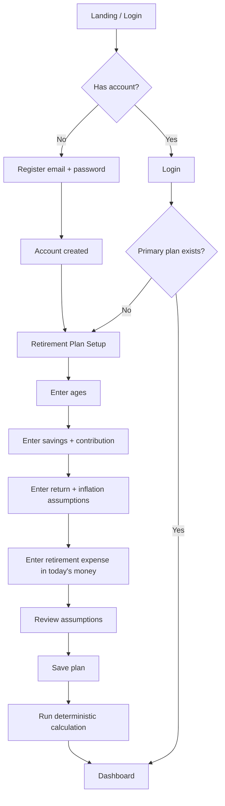

## Success outcome
User reaches the dashboard with a saved primary retirement plan and calculated KPIs.

---

# 3. Login Flow

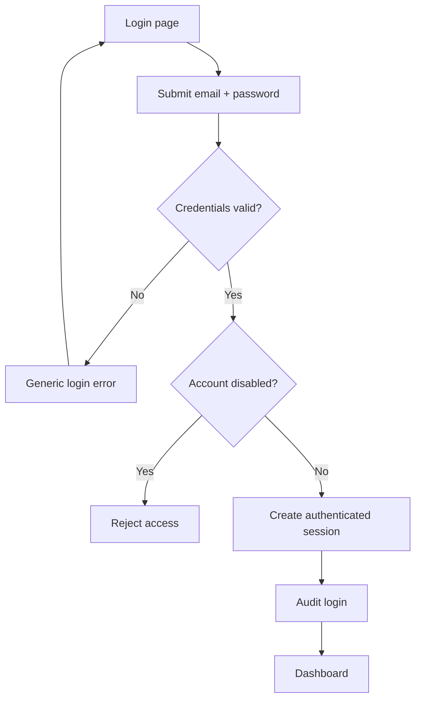

---

# 4. Create / Edit Retirement Plan Flow

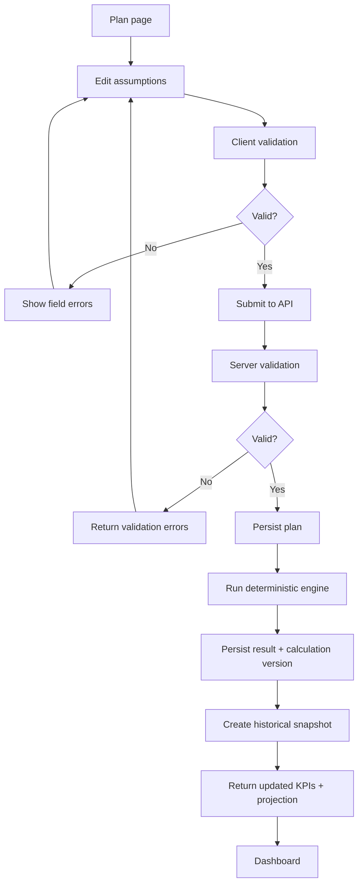

---

# 5. Dashboard Flow

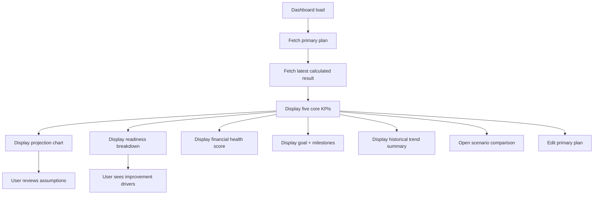

---

# 6. Scenario Comparison Flow

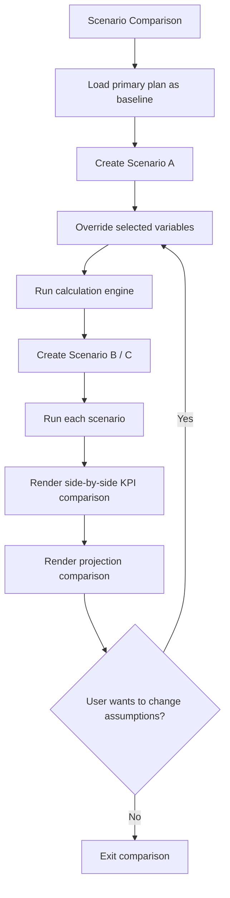

## v1 scenario override fields
- Retirement Age
- Monthly Contribution
- Expected Return
- Monthly Expense After Retirement

Scenario calculations never silently overwrite the primary plan.

---

# 7. Goal Tracking Flow

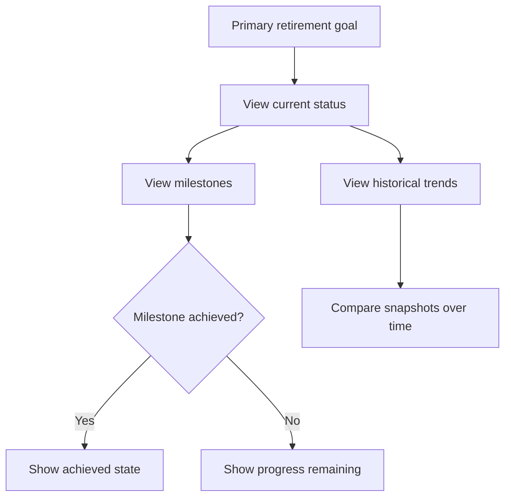

---

# 8. Retirement Projection Flow

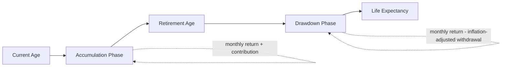

The chart should render a continuous timeline while visually separating accumulation and drawdown phases.

---

# 9. Portfolio Depletion Flow

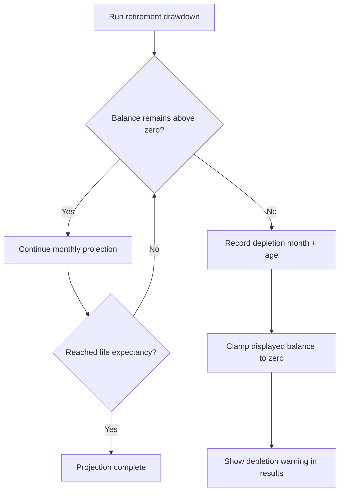

---

# 10. Admin User Management Flow

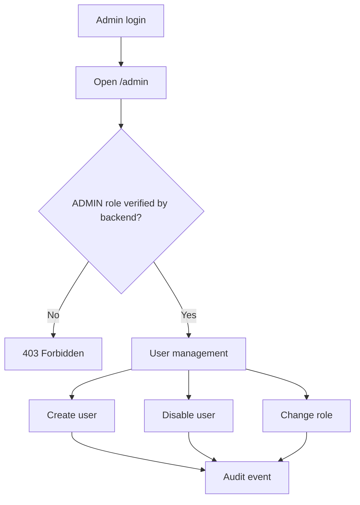

---

# 11. Production Release Flow

```mermaid
flowchart TD
    A[Merge/push to main] --> B[CI build + test]
    B --> C{CI passed?}
    C -- No --> D[Stop]
    C -- Yes --> E[Publish immutable GHCR images]
    E --> F[Auto-deploy same digest to staging]
    F --> G[Staging readiness + validation]
    G --> H{Ready for release?}
    H -- No --> I[Fix on main]
    I --> A

    H -- Yes --> J[Create SemVer release tag]
    J --> K[Production preflight]
    K --> L[Verify digest + commit + build metadata]
    L --> M[Pre-deploy PostgreSQL backup]
    M --> N{Backup success?}
    N -- No --> O[Block deploy + Telegram alert]
    N -- Yes --> P[Run reviewed DB migration]
    P --> Q[Deploy immutable images]
    Q --> R[/ready check]
    R --> S{Ready?}
    S -- No --> T[Rollback to last known good]
    S -- Yes --> U[Automated production smoke test]
    U --> V{Smoke passes?}
    V -- No --> T
    V -- Yes --> W[Mark release last known good]
    W --> X[Record release metadata]
    X --> Y[Deployment complete]
    T --> Z[Recheck readiness + alert]
```

---

# 12. Backup Failure Flow

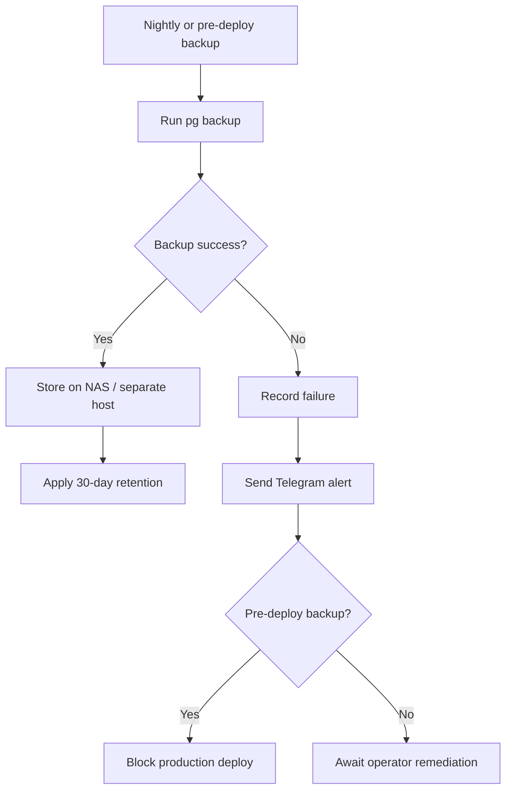

---

# 13. Navigation Map

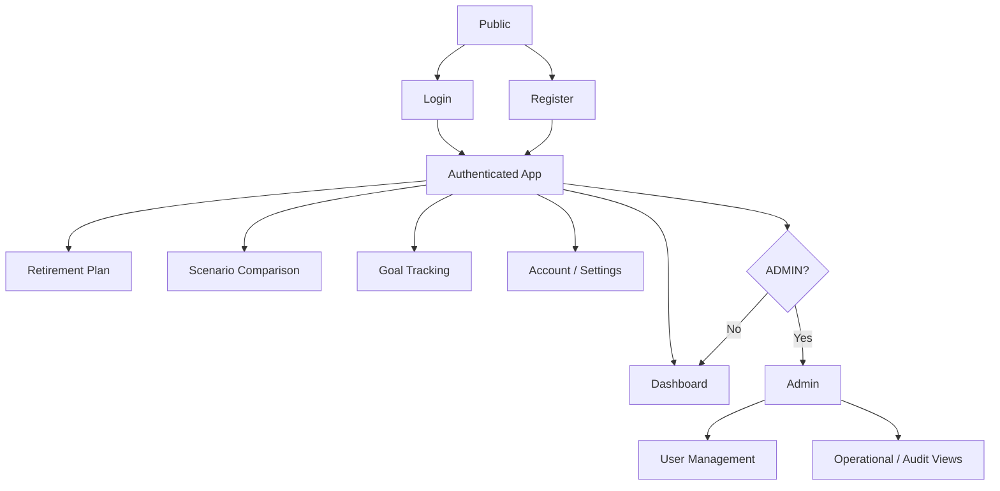
